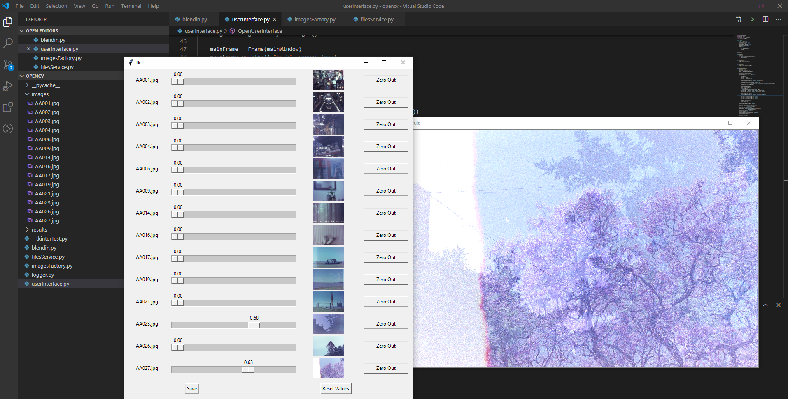

# Blendin'

Blendin' is a Python application made to blend images together easily with the help of OpenCV.

## Setting Environment
To get this application running you will need:

- Python 3 installed
- Pip installed
- (For Linux) Install Tkinter `sudo apt-get install python3-tk`
- OpenCV python module `pip3 install opencv-python`
- Pillow `pip3 install Pillow`

## Running the Application
Once everything is installed, to start the application you have to run `python3 ./blendin.py` from the root of the project.
For the application to work you will need to have all the images you are going to use on the ./images folder before running the app. When clicking save the current image is saved on the ./results folder

## Considerations
Currently the following restrictions exist, an the application won't work properly or will crash if not avoided:

- All the images on the ./images folder should be of the exact same size and same orientation(not rotated)
- All the images from the folder are loaded instantlly when running the app, and the UI does not support a large amount of images properly, less than 15 images is recommended (why would you want to blend more than that?)
